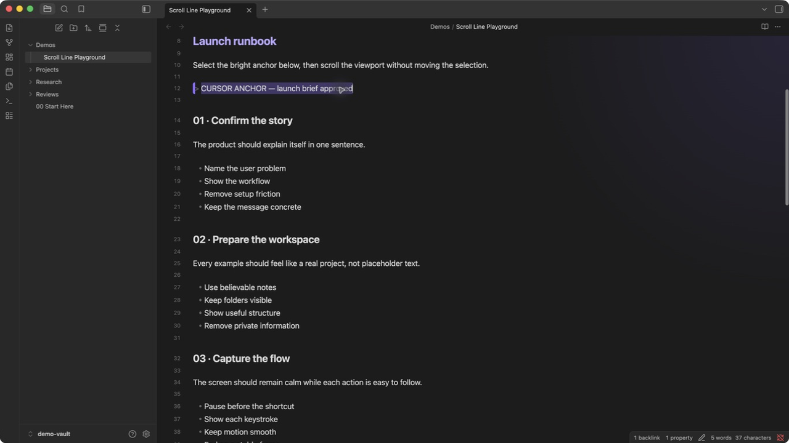
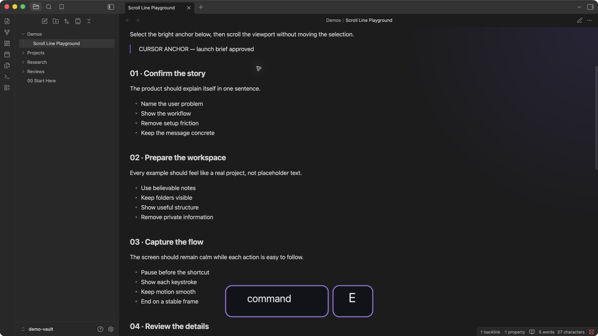
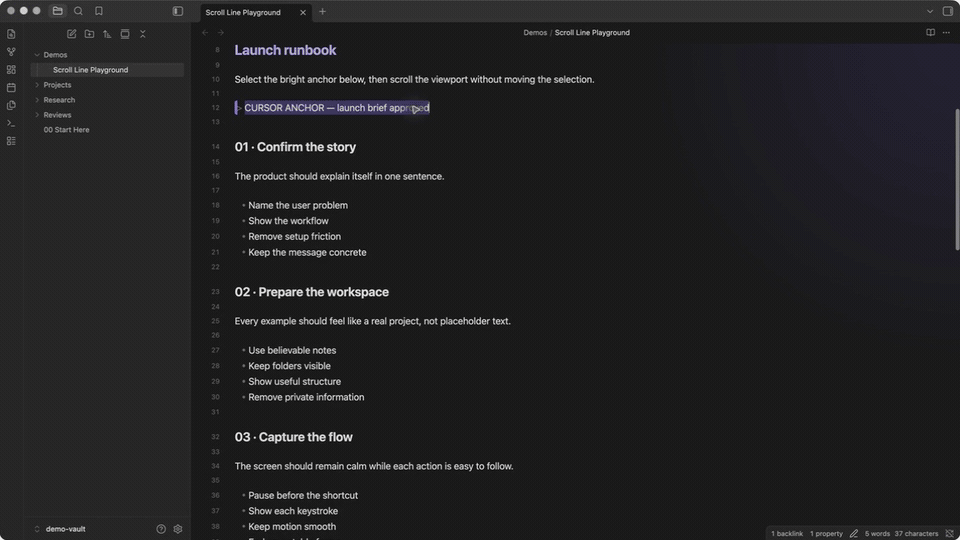

# Scroll Line

  <strong>Move the viewport, not the cursor.</strong> 
  Scroll an Obsidian note by exact lines while your cursor and selection stay put.

  

| Selection stays put | Works in Reading mode |
| --- | --- |
|  |  |

## See it in action

_Demo setting: 4 lines per keypress._

  <a href="docs/assets/scroll-line-demo.mp4">Watch the full-quality recording</a>

## What it does

- Scrolls by a configurable number of visual lines
- Keeps the cursor and selection exactly where they are
- Supports smooth animation and continuous key repeat
- Works in Editing and Reading modes
- Uses the active view's line height, so movement stays accurate across themes and font sizes

## Shortcuts

| Action | Editing mode default |
| --- | --- |
| Scroll down | `Ctrl` + `Option` + `Down` |
| Scroll up | `Ctrl` + `Option` + `Up` |

Change either binding in **Settings > Hotkeys**. Assign the commands there if you also want to use them in Reading mode.

## Settings

Open **Settings > Scroll Line** to change:

- **Lines per scroll:** Number of lines moved by each keypress
- **Smooth scroll:** Animate movement instead of jumping instantly

## Install

Open [Scroll Line in the Obsidian Community directory](https://community.obsidian.md/plugins/scroll-line), then press **Add to Obsidian**.

For a manual installation, download `main.js`, `manifest.json`, and `styles.css` from the [latest release](https://github.com/AbdelrahmanHafez/obsidian-scroll-line/releases/latest), then place them in `<vault>/.obsidian/plugins/scroll-line/`.

## License

[MIT](LICENSE)
